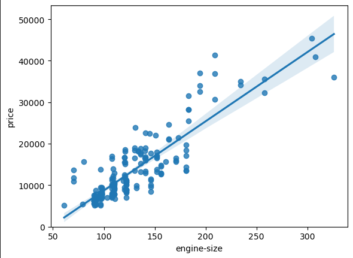
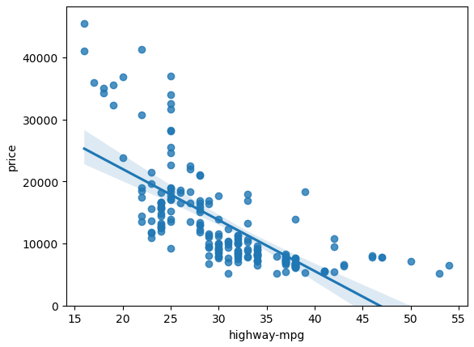
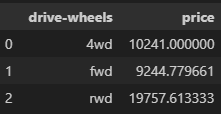
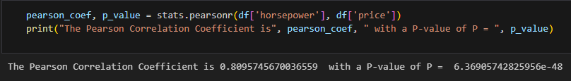
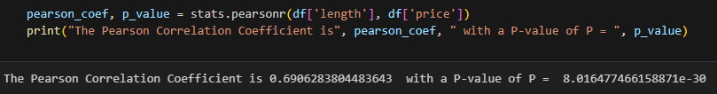
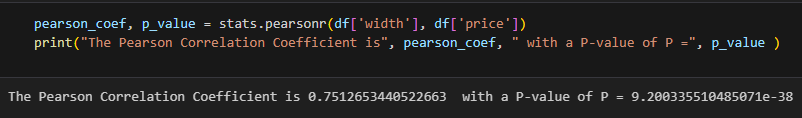
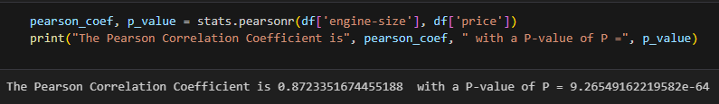
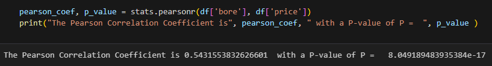
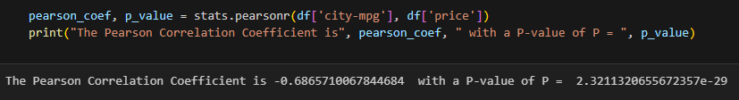
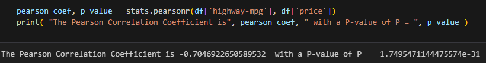

# Automobile Data Analysis

## Objective
Analyze factors affecting price, fuel efficiency and vehicle performance using a historical automobile dataset.

## Description
This project involves exploring and modeling a dataset containing specifications of various automobiles. The goal is to identify relationships between attributes like engine size, horsepower, and weight with miles-per-gallon (MPG), and to build predictive models to predict price based on the features.

## Installation
Install required libraries using pip:

```bash
pip install pandas numpy matplotlib seaborn scikit-learn
```

## Dataset
- **Source:** Automobile Dataset  
- **Content:** 200+ entries including features such as make, number of doors, body style, engine location, length, compression ratio, horsepower, peak-rpm, city mpg, highway mpg, horsepower-binned, and designation of diesel or gas.

## Tools & Technologies
You can install the required libraries using:
```bash
pip install pandas numpy matplotlib seaborn sklearn
```

## Methodology
- **Data Cleaning:** Handled missing values and data type conversions.
- **Exploratory Data Analysis (EDA):** Visualized distributions and correlations (e.g., weight vs. MPG).
- **Feature Engineering:** Created new features and transformed categorical variables.
- **Modeling:** Linear Regression and Multiple Linear Regression models were trained and evaluated.
- **Evaluation:** Used R² score and RMSE to assess model performance.

## Insights Gained
- As the engine-size goes up, the price goes up: this indicates a positive direct correlation between these two variables. Engine size seems like a pretty good predictor of price since the regression line is almost a perfect diagonal line.

- As highway-mpg goes up, the price goes down: this indicates an inverse/negative relationship between these two variables. Highway mpg could potentially be a predictor of price.

- From our data, it seems rear-wheel drive vehicles are, on average, the most expensive, while 4-wheel and front-wheel are approximately the same in price.

- Since the p-value is $<$ 0.001, the correlation between wheel-base and price is statistically significant, although the linear relationship isn't extremely strong (~0.585).

- Since the p-value is $<$ 0.001, the correlation between horsepower and price is statistically significant, and the linear relationship is quite strong (~0.809, close to 1).

- Since the p-value is $<$ 0.001, the correlation between length and price is statistically significant, and the linear relationship is moderately strong (~0.691).

- Since the p-value is < 0.001, the correlation between width and price is statistically significant, and the linear relationship is quite strong (~0.751).

- Since the p-value is $<$ 0.001, the correlation between engine-size and price is statistically significant, and the linear relationship is very strong (~0.872).

- Since the p-value is $<$ 0.001, the correlation between bore and price is statistically significant, but the linear relationship is only moderate (~0.521).

- Since the p-value is $<$ 0.001, the correlation between city-mpg and price is statistically significant, and the coefficient of about -0.687 shows that the relationship is negative and moderately strong.

- Since the p-value is < 0.001, the correlation between highway-mpg and price is statistically significant, and the coefficient of about -0.705 shows that the relationship is negative and moderately strong.

- The variable "highway-mpg" has a stronger correlation with "price", it is approximate -0.704692  compared to "peak-rpm" which is approximate -0.101616

- A residual is the difference between the observed value (y) and the predicted value (Yhat) is called the residual (e). When we look at a regression plot, the residual is the distance from the data point to the fitted regression line. If the points in a residual plot are <b>randomly spread out around the x-axis</b>, then a <b>linear model is appropriate</b> for the data. Randomly spread out residuals means that the variance is constant, and thus the linear model is a good fit for this data. We can see from this residual plot that the residuals are not randomly spread around the x-axis, leading us to believe that maybe a non-linear model is more appropriate for this data.

- One way to look at the fit of the multiple linear regression model is by looking at the <b>distribution plot</b>. We can look at the distribution of the fitted values that result from the model and compare it to the distribution of the actual values.

- We saw earlier that a linear model did not provide the best fit while using "highway-mpg" as the predictor variable. Let's see if we can try fitting a polynomial model to the data instead.


- Comparing these three models, we conclude that <b>the MLR model is the best model</b> to be able to predict price from our dataset. This result makes sense since we have 27 variables in total and we know that more than one of those variables are potential predictors of the final car price

